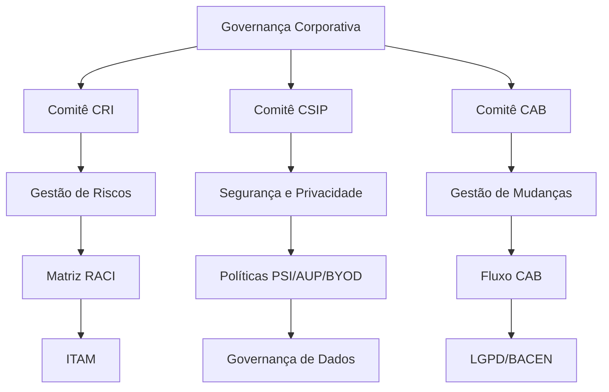
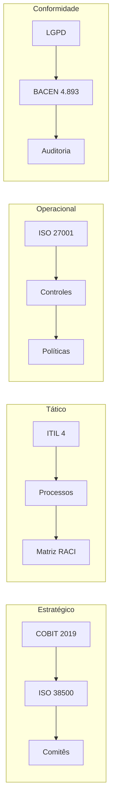

<div align="center">

</div>

# Run and deploy your AI Studio app

This contains everything you need to run your app locally.

View your app in AI Studio: https://ai.studio/apps/17dcd698-bba9-4847-b3ed-10e180ff47ed

## Run Locally

**Prerequisites:**  Node.js


1. Install dependencies:
   `npm install`
2. Set the `GEMINI_API_KEY` in [.env.local](.env.local) to your Gemini API key
3. Run the app:
   `npm run dev`

# 📊 NeoCredit - Governance Suite

## Implementação de Governança, Conformidade Regulatória e Gestão de Risco em Instituição Financeira Digital

---

## 📋 Índice

- [Sobre o Projeto](#sobre-o-projeto)
- [Visão Geral da Solução](#visão-geral-da-solução)
- [Arquitetura da Solução](#arquitetura-da-solução)
- [Funcionalidades](#funcionalidades)
- [Tecnologias Utilizadas](#tecnologias-utilizadas)
- [Como Executar](#como-executar)
- [Estrutura do Projeto](#estrutura-do-projeto)
- [Frameworks e Normas Aplicadas](#frameworks-e-normas-aplicadas)
- [Métricas e Indicadores](#métricas-e-indicadores)
- [Plano de Implementação](#plano-de-implementação)
- [Análises Avançadas](#análises-avançadas)
- [Dashboard Interativo](#dashboard-interativo)
- [Benefícios e ROI](#benefícios-e-roi)
- [Próximos Passos](#próximos-passos)
- [Autores e Contato](#autores-e-contato)

---

## Sobre o Projeto

### Contexto

A **NeoCredit**, uma FinTech em fase de expansão acelerada, dobrou sua base de clientes e o volume de transações nos últimos 18 meses. Para suportar esse crescimento, a área de Tecnologia da Informação realizou aquisições massivas de infraestrutura em nuvem e lançou novas funcionalidades no aplicativo de forma descentralizada.

### O Problema

A agilidade técnica cobrou um preço alto: a empresa perdeu completamente o controle sobre sua governança corporativa e tecnológica.

**Incidentes Críticos:**

1. **Mudança não documentada no banco de dados** causou 4 horas de indisponibilidade no aplicativo, gerando prejuízos financeiros e danos à reputação.

2. **Dados sensíveis de clientes** espalhados em ambientes de desenvolvimento sem criptografia ou anonimização, risco iminente de autuação pelo BACEN e multas severas sob a LGPD.

### O Desafio

Diagnosticar o cenário caótico (estado **As-Is**) e propor um plano de ação estratégico (estado **To-Be**) para elevar a maturidade da organização, transformando a TI em uma parceira estratégica do negócio.

---

## Visão Geral da Solução

### Estrutura de Governança Proposta



### Componentes da Solução

| Componente | Descrição | Status |
|------------|-----------|--------|
| **3 Comitês Estratégicos** | CRI, CSIP, CAB | ✅ Estruturados |
| **Matriz RACI** | Clareza de responsabilidades | ✅ Definida |
| **4 Políticas** | PSI, BCP, RBAC, Gestão de Mudanças | 📝 Em implementação |
| **ITAM** | Gestão de Ativos de TI (ISO 19770) | 🔄 35% |
| **Fluxo CAB** | Controle de mudanças | ⏳ Em implantação |
| **Governança de Dados** | LGPD e BACEN | 🔄 38% |

---

## Arquitetura da Solução

### Modelo de Governança Integrado



### Harmonização de Frameworks

| Framework | Papel na NeoCredit | Aplicação Prática |
|-----------|-------------------|-------------------|
| **COBIT 2019** | Governança Estratégica | Comitês, RACI, BSC |
| **ITIL 4** | Gestão de Serviços | CAB, Change Management, Incident Management |
| **ISO 27001** | Controles de Segurança | Criptografia, PSI, AUP, BYOD |
| **ISO 38500** | Governança Corporativa | Princípios de governança |
| **LGPD** | Proteção de Dados | Governança de dados, DPO |
| **BACEN 4.893** | Cibersegurança | Política de segurança, simulados |

---

## Funcionalidades

### 1. 🏛️ Comitês de Governança

#### Comitê de Gestão de Riscos e Incidentes (CRI)
- **Missão:** Supervisionar integridade tecnológica frente a crises
- **Membros:** DPO, Diretora de Compliance, CISO
- **Periodicidade:** Mensal (extraordinário em crises)
- **Responsabilidades:**
  - Declaração de crise em vazamento (CISO)
  - Relatórios à ANPD/BACEN (Compliance)
  - Mitigação técnica de ataques (CISO)
  - Aprovação de resiliência (Comitê)

#### Comitê de Segurança da Informação e Privacidade (CSIP)
- **Missão:** Definir diretrizes PSI e auditar privacidade
- **Membros:** CISO, DPO, Gerente de Compliance
- **Periodicidade:** Mensal
- **Responsabilidades:**
  - Revisão da PSI (CISO)
  - Letramento de segurança (DPO & RH)
  - Auditoria de frameworks (Gerente Compliance)
  - Mapeamento de dados (DPO)

#### Comitê Consultivo de Mudanças (CAB)
- **Missão:** Aprovar releases em produção
- **Membros:** Líder SRE, CISO, Gerente de Negócio
- **Periodicidade:** Semanal (extraordinário para mudanças críticas)
- **Responsabilidades:**
  - Avaliar impactos técnicos (Líder SRE)
  - Aprovar formalmente (CAB colegiado)
  - Validar deploy em produção (Líder SRE)
  - Atualizar guias de rollback (Líder SRE)

### 2. 📊 Matriz RACI - Gestão de Mudanças

| Atividade | Líder Técnico | CAB | CISO | Gerente Negócio | Desenvolvedor |
|-----------|---------------|-----|------|-----------------|---------------|
| Registrar RFC | **R** | C | I | I | C |
| Avaliar impacto/risco | C | **R** | C | C | I |
| Aprovar mudança | I | **A** | C | A | I |
| Implementar em homologação | **R** | I | I | I | **R** |
| Validar em produção | **R** | C | I | **A** | C |
| Atualizar documentação | **R** | I | I | I | **R** |

**Legenda:**
- **R** = Responsável (quem executa)
- **A** = Aprovador (quem aprova)
- **C** = Consultado (quem deve ser consultado)
- **I** = Informado (quem deve ser informado)

### 3. 📚 Biblioteca de Políticas

| Política | Código | Status | Eficácia | Dono |
|----------|--------|--------|----------|------|
| Segurança da Informação | POL-SEC-01 | ✅ Aprovada | 100% | CISO |
| Continuidade de Negócios | POL-BCP-02 | ✅ Aprovada | 85% | CISO |
| Controle de Acesso (RBAC) | POL-IAM-03 | 🔄 Revisão | 70% | Líder IAM |
| Gestão de Mudanças | POL-CHG-04 | 📝 Rascunho | 45% | Líder SRE |

#### Política de Uso Aceitável (AUP)
- Senhas: 12+ caracteres, especiais, reciclagem a cada 90 dias
- Zelo de Acesso: Compartilhamento de credenciais é proibido
- Bloqueio: Suspensão automática por inatividade após 5 minutos
- Software: Apenas aplicativos homologados pela TI
- Shadow IT: Proibida
- Monitoramento: Tráfego de rede e logs monitorados continuamente

#### BYOD (Bring Your Own Device)
- Silos de Acesso: Conexões limitadas a e-mail e canais institucionais
- Criptografia: Blindagem de disco obrigatória
- Containerização: MDM para segregar dados pessoais e corporativos
- Wipe Remoto: Acionamento em até 30 minutos em caso de perda
- Adesão: Assinatura digital de termos obrigatória

### 4. 🛡️ ITAM - Gestão de Ativos de TI

#### Status Atual
- **Cobertura ITAM:** 35%
- **Meta:** 100%
- **Base:** ISO/IEC 19770

#### O Que Precisa Ser Inventariado
| Categoria | Itens |
|-----------|-------|
| **Cloud** | Instâncias, provedores, custos, gestores |
| **Hardware** | Laptops, endpoints, celulares homologados |
| **Software** | Licenças, seats, versões |
| **Ambientes** | Produção, homologação, staging |

#### Ciclo de Vida dos Ativos
```
Aquisição → Homologação → Apoio Corretivo → Descarte Seguro
```

#### Varreduras Automatizadas
- Varreduras IP mensais em subsegmentos de rede
- Identificação de Shadow IT
- Neutralização de ativos não cadastrados

---

## Tecnologias Utilizadas

### Frontend
- **HTML5** - Estrutura semântica
- **CSS3** - Estilização com variáveis CSS e Grid/Flexbox
- **JavaScript (ES6+)** - Lógica de negócio e interatividade
- **Chart.js** - Gráficos interativos (linha, barra, pizza, radar, doughnut, bubble, scatter)
- **Font Awesome 6** - Ícones vetoriais
- **Google Fonts (Inter)** - Tipografia profissional

### Ferramentas de Análise
- **Chart.js com plugins:** Annotations, Datalabels
- **SheetJS (XLSX)** - Exportação para Excel
- **html2canvas** - Captura de tela para PDF

### Persistência
- **localStorage** - Armazenamento local dos dados
- **JSON** - Formato de dados para backup/restore

### Frameworks de Governança
- **COBIT 2019** - Governança corporativa de TI
- **ITIL 4** - Gestão de serviços de TI
- **ISO 27001:2022** - Segurança da informação
- **ISO 38500** - Governança de TI para organizações

### Normas Regulatórias
- **LGPD** - Lei Geral de Proteção de Dados
- **BACEN 4.893** - Cibersegurança no setor financeiro

---

## Como Executar

### Opção 1: Google AI Studio

1. Acesse [Google AI Studio](https://aistudio.google.com/)
2. Clique em **"New Prompt"** ou **"Create New"**
3. No modo de visualização, escolha **"HTML/CSS/JS"**
4. Copie todo o código do arquivo `index.html` e cole
5. Execute/visualize

### Opção 2: Navegador Local

1. Crie um arquivo `index.html`
2. Copie todo o código do projeto
3. Abra o arquivo em qualquer navegador moderno

### Opção 3: GitHub Pages

1. Fork este repositório
2. Vá em **Settings > Pages**
3. Selecione a branch `main` e a pasta `/root`
4. Acesse `https://[seu-usuario].github.io/[repo-name]`

---

## Estrutura do Projeto

```
neocredit-governance-suite/
├── index.html              # Arquivo principal (single-page application)
├── README.md               # Documentação do projeto
├── slides/
│   └── apresentacao.pdf    # Apresentação em storytelling (41 slides)
├── dados/
│   └── dados_sinteticos.json  # Dados sintéticos para demonstração
├── docs/
│   ├── diagnostico.md      # Diagnóstico As-Is
│   ├── plano_acao.md       # Plano de 90 dias
│   └── analises.md         # Análises avançadas
└── assets/
    ├── css/
    │   └── style.css       # Estilos principais
    ├── js/
    │   ├── main.js         # Lógica principal
    │   ├── crud.js         # Operações CRUD
    │   ├── charts.js       # Configuração de gráficos
    │   └── data.js         # Gerenciamento de dados
    └── img/
        └── logo.png        # Logotipo da NeoCredit
```

---

## Frameworks e Normas Aplicadas

### COBIT 2019

| Objetivo | Aplicação na NeoCredit |
|----------|----------------------|
| EDM01 - Garantir a governança | Comitês CRI, CSIP, CAB |
| EDM03 - Otimizar o risco | Matriz de risco, simulados |
| APO01 - Gerenciar o programa de TI | Plano de 90 dias |
| APO03 - Gerenciar arquitetura | ITAM, inventário |
| BAI03 - Gerenciar mudanças | CAB, Matriz RACI |
| BAI06 - Gerenciar mudanças organizacionais | Cultura de segurança |
| DSS05 - Gerenciar segurança | PSI, AUP, BYOD |
| DSS06 - Gerenciar controles de processo | Auditoria ISO 27001 |
| MEA01 - Monitorar e avaliar desempenho | BSC, KPIs/KRIs |

### ITIL 4 - Práticas Aplicadas

| Prática | Aplicação |
|---------|-----------|
| **Change Management** | CAB, Matriz RACI, POL-CHG-04 |
| **Incident Management** | CRI, playbooks de resposta |
| **Problem Management** | 5 Porquês, RCA estruturado |
| **Service Desk** | Canal de atendimento |
| **Configuration Management** | ITAM, CMDB |
| **Information Security Management** | PSI, CSIP |
| **Risk Management** | Comitê de Risco |
| **Business Relationship Management** | BRM, tradutor bilíngue |
| **Service Level Management** | SLAs, KPIs de disponibilidade |
| **Continual Improvement** | Ciclo PDCA, maturidade |

### ISO 27001:2022 - Controles Aplicados

| Controle | Descrição | Status NeoCredit |
|----------|-----------|------------------|
| A.5.1 | Políticas de segurança | ✅ Aprovada |
| A.5.2 | Funções de segurança | ✅ CISO, DPO |
| A.5.9 | Inventário de ativos | 🔄 35% |
| A.5.15 | Controle de acesso | 🔄 RBAC em revisão |
| A.5.23 | Segurança em nuvem | 🔄 Implementação |
| A.5.24 | Gestão de incidentes | 🔄 Playbooks em desenvolvimento |
| A.5.25 | Avaliação de riscos | ✅ Estruturada |
| A.5.32 | Gestão de mudanças | ⏳ CAB em implantação |
| A.6.8 | Conscientização | 🔄 15% treinados |
| A.8.11 | Criptografia | 🔄 45% |
| A.8.24 | Gestão de mudanças técnicas | ⏳ Em implantação |

### LGPD - Requisitos Aplicados

| Artigo | Exigência | Status NeoCredit |
|--------|-----------|------------------|
| Art. 41 | DPO nomeado | ⚠️ Nomeado, canal inativo |
| Art. 46 | Medidas técnicas de segurança | ❌ 45% criptografado |
| Art. 48 | Notificação à ANPD | ❌ Não estruturado |
| Art. 49 | Comunicação de incidentes | ❌ Não estruturado |
| Art. 52 | Multas e penalidades | ⚠️ Risco alto |

### BACEN 4.893 - Requisitos Aplicados

| Requisito | Exigência | Status NeoCredit |
|-----------|-----------|------------------|
| Política de segurança cibernética | Documento formal | ⚠️ Parcial |
| Governança de dados | Estrutura definida | ⚠️ Parcial |
| Controles em nuvem | Política de cloud | 🔄 Implementação |
| Simulados anuais | Teste de resiliência | ❌ Não realizados |
| Reporte anual | Comunicação ao BACEN | ❌ Não estruturado |

---

## Métricas e Indicadores

### Balanced Scorecard (BSC)

| Perspectiva | Objetivo | KPI | Meta | Status |
|-------------|----------|-----|------|--------|
| **Financeira** | Reduzir multas | Exposição financeira | R$ 0 | 🔴 R$ 1,25M |
| **Financeira** | Otimizar ROSI | Fator ROSI | >3,5x | 🔴 0,4x |
| **Cliente** | Manter uptime | Disponibilidade | 99,95% | 🟡 99,50% |
| **Interna** | Controlar mudanças | Mudanças aprovadas | 100% | 🟡 62% |
| **Aprendizagem** | Educar colaboradores | Treinamento | 100% | 🔴 15% |

### Iniciativas Recomendadas por Perspectiva

| Perspectiva | Iniciativa | Benefício |
|-------------|------------|-----------|
| **Financeira** | Criptografia AES-256 | Redução de multas |
| **Cliente** | Redundância multi-região | Uptime 99,95% |
| **Interna** | Bloqueio CI/CD sem CAB | 100% de controle |
| **Aprendizagem** | Campanhas gamificadas | 100% treinados |

---

## Plano de Implementação

### Visão Geral - 90 Dias

```
Maturação Geral: 25% → 100%
```

| Fase | Período | Foco | Maturação |
|------|---------|------|-----------|
| **Mês 1** | Sem 1-4 | Diagnóstico e Estruturação | 25% → 45% |
| **Mês 2** | Sem 5-8 | Controles Técnicos Ativos | 45% → 70% |
| **Mês 3** | Sem 9-12 | Maturidade e Auditorias | 70% → 100% |

### Mês 1 - Diagnóstico e Estruturação (Semanas 1-4)

| Iniciativa | Responsável | Prazo | Status |
|------------|-------------|-------|--------|
| Mapeamento de dados sensíveis | DPO | Sem 1-2 | ✅ Concluído |
| Aprovação e publicação da PSI | CISO | Sem 2-3 | ✅ Concluído |
| Instauração do CAB | Líder SRE | Sem 3-4 | ⏳ Em andamento |

### Mês 2 - Controles Técnicos Ativos (Semanas 5-8)

| Iniciativa | Responsável | Prazo | Status |
|------------|-------------|-------|--------|
| Criptografia AES-256 | Equipe Sec | Sem 5-6 | ⏳ Pendente |
| Workshop de Privacidade | DPO & RH | Sem 6-7 | ⏳ Pendente |
| SAST/DAST no pipeline | DevSecOps | Sem 7-8 | ⏳ Pendente |

### Mês 3 - Maturidade e Auditorias (Semanas 9-12)

| Iniciativa | Responsável | Prazo | Status |
|------------|-------------|-------|--------|
| Simulado de Ransomware | Comitê CRI | Sem 9-10 | ⏳ Pendente |
| Auditoria externa ISO 27001 | CISO & Auditor | Sem 11-12 | ⏳ Pendente |

---

## Análises Avançadas

### 1. 📊 Análise Descritiva

| Métrica | Valor |
|---------|-------|
| Média de Downtime | 4,4h/mês |
| Pico de indisponibilidade | 7,12h (Dez/25) |
| Correlação falhas × CAB | 0,079 (alta) |
| Mudanças não aprovadas | 38% |
| Dados expostos (média) | 55% |

### 2. 🔍 Análise Diagnóstica - 5 Porquês

| Nível | Pergunta | Resposta |
|-------|----------|----------|
| 1º Porquê | Por que o Pix caiu? | API secundária sobrecarregou |
| 2º Porquê | Por que a API sobrecarregou? | Mudança na política de timeout |
| 3º Porquê | Por que a mudança foi sem testes? | Equipe considerou 'baixo risco' |
| 4º Porquê | Por que a equipe burlou a homologação? | Não há travas de conformidade |
| 5º Porquê | Por que não há travas? | **Ausência de RACI, CAB e cultura de governança** |

### 3. 🎯 Análise Prescritiva

#### Matriz Esforço vs Impacto

| Iniciativa | Esforço (1-10) | Impacto (1-10) | Categoria | Custo Estimado |
|------------|---------------|----------------|-----------|----------------|
| Fluxo CAB & RACI | 3 | 9 | ⭐ Quick Win | R$ 45K |
| Criptografia Total | 8 | 10 | Projeto Estratégico | R$ 300K |
| Treinamento 100% | 6 | 8 | Projeto Prioritário | R$ 80K |
| ITAM Completo | 5 | 6 | Médio Prazo | R$ 50K |
| DPO e Canal LGPD | 2 | 8 | Quick Win | R$ 25K |
| SIEM/Logs | 7 | 7 | Longo Prazo | R$ 150K |

### 4. 📈 Análise Preditiva

#### Previsão de Downtime (Regressão Linear)

| Período | Previsão | Intervalo de Confiança |
|---------|----------|----------------------|
| Julho 2026 | 4,59h | 4,31 - 4,87h |
| Agosto 2026 | 4,62h | 4,33 - 4,91h |
| Setembro 2026 | 4,65h | 4,35 - 4,95h |

**Métricas do Modelo:**
- R² = 0,0063
- RMSE = 1,31h
- Tendência: Escalada gradual

**Conclusão:** Se nenhuma ação de governança for tomada, o downtime pode ultrapassar 5h/mês no segundo semestre de 2026.

### 5. 📝 Resumo Executivo

```
Implementação imediata do Plano de 90 Dias
ROSI Projetado: +600%
Redução de Multas: Até R$ 50 milhões
Redução de Downtime: 4,4h → <1h/mês
Cultura de Segurança: 15% → 100% treinados
```

---

## Dashboard Interativo

### Funcionalidades do Dashboard

1. **KPIs em Tempo Real**
   - Disponibilidade do App
   - Mudanças Aprovadas pelo CAB
   - Dados Criptografados
   - Colaboradores Treinados

2. **Gráficos Dinâmicos**
   - Linha: Histórico de Disponibilidade
   - Barras: KPIs vs Meta
   - Pizza: Distribuição por Frequência
   - Radar: Maturidade dos Comitês
   - Gauge: Progresso da Conformidade

3. **CRUD Completo**
   - Adicionar/Editar/Excluir KPIs
   - Adicionar/Editar/Excluir Comitês
   - Adicionar/Editar/Excluir Políticas
   - Adicionar/Editar/Excluir Sprints
   - Editar Matriz RACI

4. **Exportação de Dados**
   - Exportar relatório BSC (CSV)
   - Exportar dados completos (JSON)
   - Captura de tela para PDF

5. **Análises Avançadas**
   - Descritiva: Estatísticas e correlações
   - Diagnóstica: 5 Porquês
   - Prescritiva: Matriz Esforço vs Impacto
   - Preditiva: Regressão Linear

### Como Usar o Dashboard

1. **Navegação:** Use a barra lateral para alternar entre as abas
2. **Edição:** Clique em "Editar" em qualquer card para modificar dados
3. **Adição:** Use os botões "+ Adicionar" para criar novos itens
4. **Visualização:** Todos os gráficos atualizam automaticamente
5. **Exportação:** Use os botões na barra lateral para exportar relatórios

---

## Benefícios e ROI

### Benefícios Financeiros

| Benefício | Valor |
|-----------|-------|
| **ROSI** | +600% |
| **Multas evitadas** | Até R$ 50M |
| **Downtime reduzido** | 4,4h → <1h/mês |
| **Economia OPEX** | +R$ 480K/ano |
| **Custo de implementação** | R$ 500K/ano |

### Benefícios Estratégicos

- ✅ TI como parceira estratégica do negócio
- ✅ Conformidade plena com LGPD e BACEN
- ✅ Cultura de segurança consolidada
- ✅ Preparação para certificação ISO 27001
- ✅ Redução de riscos reputacionais
- ✅ Aumento da confiança dos clientes
- ✅ Vantagem competitiva no mercado

### ROI vs ROSI

#### ROI (Retorno sobre Investimento)
- **Aplicável:** Projetos que geram receita ou economia
- **Fórmula:** ((Ganhos - Custo) / Custo) × 100
- **Exemplo:** Migração Cloud → +R$ 1,2M/ano

#### ROSI (Retorno sobre Investimento em Segurança)
- **Aplicável:** Projetos que evitam sinistros
- **Fórmula:** ((Perda Evitada - Investimento) / Investimento) × 100
- **Exemplo NeoCredit:**
  - Perda evitada: R$ 3,5M
  - Investimento: R$ 500K
  - **ROSI = +600%**

> 💰 **Cada R$ 1 investido → R$ 6 de retorno**

---

## Próximos Passos

### 📋 Checklist de Implementação

- [ ] **Aprovação do Plano de 90 Dias pela Governança**
- [ ] **Nomeação formal dos membros dos comitês** (CRI, CSIP, CAB)
- [ ] **Publicação das Políticas** (PSI, BCP, RBAC, Gestão de Mudanças)
- [ ] **Implementação do Fluxo CAB e Matriz RACI** (Quick Win)
- [ ] **Criptografia AES-256** em todos os dados sensíveis
- [ ] **Treinamento de 100% dos colaboradores** em segurança
- [ ] **Simulado de Ransomware** (teste de resposta a crises)
- [ ] **Auditoria externa** para certificação ISO 27001
- [ ] **ROSI report** trimestral para a Governança

### 📊 Cronograma de Acompanhamento

| Marco | Prazo | Entregável |
|-------|-------|------------|
| **Revisão 1** | 30 dias | Status dos Quick Wins |
| **Revisão 2** | 60 dias | Controles técnicos implementados |
| **Revisão Final** | 90 dias | Auditoria e certificação |
| **Acompanhamento** | Trimestral | ROSI e KPIs |

---

## Autores e Contato

### Consultor Especialista em Governança de TI

**Nome:** [Seu Nome]

**Especialidades:**
- Governança Corporativa de TI (COBIT, ITIL, ISO 38500)
- Segurança da Informação (ISO 27001, NIST)
- Conformidade Regulatória (LGPD, BACEN)
- Gestão de Riscos e Continuidade de Negócios

**Contato:**
- 📧 Email: [seu-email@dominio.com]
- 📱 Telefone: (XX) XXXXX-XXXX
- 💼 LinkedIn: [linkedin.com/in/seu-perfil]

---

## 📄 Licença

Este projeto está licenciado sob a licença MIT - veja o arquivo [LICENSE](LICENSE) para detalhes.

---

## 📚 Referências

### Livros e Publicações
- FERNANDES, A. A.; ABREU, V. F. *Implantando a governança de TI: da estratégia à gestão de processos e serviços*. 4. ed. Rio de Janeiro: Brasport, 2022.
- ISACA. *COBIT 2019 Framework: Governance and Management Objectives*. ISACA, 2018.
- AXELOS. *ITIL 4 Foundation*. TSO, 2019.
- ABNT. *ISO/IEC 27001:2022 - Segurança da informação, cibersegurança e proteção da privacidade*. 2022.
- ABNT. *ISO/IEC 38500:2024 - Governança de TI para organizações*. 2024.

### Normas e Regulamentações
- Lei nº 13.709/2018 - Lei Geral de Proteção de Dados (LGPD)
- Resolução BCB nº 4.893 - Política de Segurança Cibernética
- Resolução BCB nº 4.658 - Governança de Dados

### Artigos e Casos de Estudo
- "Fintechs e Governança de TI: Desafios e Oportunidades" - FGV, 2025
- "ROSI: Return on Security Investment no Setor Financeiro" - Gartner, 2024
- "Casos de Sucesso em Governança de TI" - ISACA Brasil, 2025

---

## 🏆 Reconhecimentos

Este projeto foi desenvolvido como parte do desafio de implementação de governança, conformidade regulatória e gestão de risco em instituição financeira digital.

Agradecimentos especiais a todos os stakeholders da NeoCredit que contribuíram com insights e feedbacks durante o desenvolvimento deste projeto.

---

**Última atualização:** Julho 2026

**Versão:** 2.0

---

# 📋 Apêndices

## Apêndice A: Dicionário de Termos

| Termo | Definição |
|-------|-----------|
| **AUP** | Acceptable Use Policy - Política de Uso Aceitável |
| **BACEN** | Banco Central do Brasil |
| **BSC** | Balanced Scorecard |
| **BYOD** | Bring Your Own Device |
| **CAB** | Change Advisory Board |
| **CISO** | Chief Information Security Officer |
| **COBIT** | Control Objectives for Information and Related Technologies |
| **CRI** | Comitê de Gestão de Riscos e Incidentes |
| **CSIP** | Comitê de Segurança da Informação e Privacidade |
| **DPO** | Data Protection Officer |
| **EDA** | Análise Exploratória de Dados |
| **ITAM** | IT Asset Management |
| **ITIL** | Information Technology Infrastructure Library |
| **KPI** | Key Performance Indicator |
| **KRI** | Key Risk Indicator |
| **LGPD** | Lei Geral de Proteção de Dados |
| **MTTR** | Mean Time To Recover |
| **OWASP** | Open Web Application Security Project |
| **RACI** | Responsável, Aprovador, Consultado, Informado |
| **RCA** | Root Cause Analysis |
| **ROI** | Return on Investment |
| **ROSI** | Return on Security Investment |
| **SAST** | Static Application Security Testing |
| **SRE** | Site Reliability Engineering |

## Apêndice B: Matriz de Responsabilidades Completa

### Comitê CRI

| Atividade | R | A | C | I |
|-----------|---|---|---|---|
| Declaração de crise | CISO | DPO | Compliance | CEO |
| Relatórios regulatórios | Compliance | DPO | Jurídico | Público |
| Mitigação de ataques | CISO | Diretor TI | Engenharia | CRI |
| Plano de resiliência | CISO | CRI | Todos | Board |

### Comitê CSIP

| Atividade | R | A | C | I |
|-----------|---|---|---|---|
| Revisão PSI | CISO | CSIP | Jurídico | Todos |
| Mapeamento de dados | DPO | CSIP | TI | Board |
| Auditoria ISO | Compliance | CSIP | CISO | Board |
| Campanhas de segurança | DPO | CSIP | RH | Todos |

### Comitê CAB

| Atividade | R | A | C | I |
|-----------|---|---|---|---|
| Registrar RFC | Dev | CAB | SRE | Negócio |
| Avaliar riscos | SRE | CAB | CISO | Negócio |
| Aprovar mudança | CAB | Board | SRE | Negócio |
| Validar deploy | SRE | CAB | CISO | Negócio |

---

**Fim do README**
